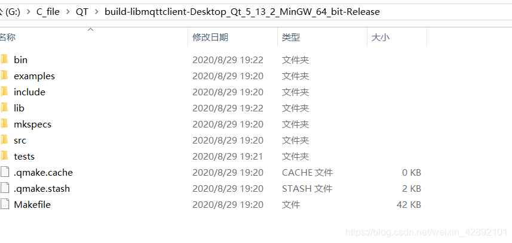

@[toc](基于QTmqtt客户端多种配置)
最近项目上要用到mqtt，当然了现在mqtt都已经是物联网时代的标配组件了，之前是C端的使用基于mosquitto库没有做过界面的，现在基于`qmqtt开源库14.2`编写的ui界面，当然以后可能经常调用，已经封装成库的形式。
# 效果图

# 主要功能
## 配置功能
软件启动首先会查找配置文件`MQTT_CONFIG.json`没有就会生成新的默认配置
> windows端默认在程序启动处查找
> linux端在/etc目录查找
> 

内容格式如下：
- 为啥有四个配置呢，因为当初设想做成多配置启动或者连接多个平台
- 目前多配置功能已经具备，只是界面的接口没有地方放，所以ui上没有切换配置的接口
```bash
{
    "MQTT_CONFIG": [
        {
            "MqttConfigNum": "Client_0",
            "MqttKeepAlive": 300,
            "MqttServerAddr": "broker.hivemq.com",
            "MqttServerIp": "192.168.50.128",
            "MqttServerPort": 1883,
            "MqttUserKey": "123456",
            "MqttUserName": "admin",
            "PublishTopic": [
                {
                    "MqttPUBQos": 0,
                    "MqttPublishTopic": ""
                }
            ],
            "SubscribeTopic": [
                {
                    "MqttSUBQos": 0,
                    "MqttSubscribeTopic": ""
                }
            ]
        },
        {
            "MqttConfigNum": "Client_1",
            "MqttKeepAlive": 300,
            "MqttServerAddr": "broker.hivemq.com",
            "MqttServerIp": "192.168.50.128",
            "MqttServerPort": 1883,
            "MqttUserKey": "123456",
            "MqttUserName": "admin",
            "PublishTopic": [
                {
                    "MqttPUBQos": 0,
                    "MqttPublishTopic": ""
                }
            ],
            "SubscribeTopic": [
                {
                    "MqttSUBQos": 0,
                    "MqttSubscribeTopic": ""
                }
            ]
        },
        {
            "MqttConfigNum": "Client_2",
            "MqttKeepAlive": 300,
            "MqttServerAddr": "broker.hivemq.com",
            "MqttServerIp": "192.168.50.128",
            "MqttServerPort": 1883,
            "MqttUserKey": "123456",
            "MqttUserName": "admin",
            "PublishTopic": [
                {
                    "MqttPUBQos": 0,
                    "MqttPublishTopic": ""
                }
            ],
            "SubscribeTopic": [
                {
                    "MqttSUBQos": 0,
                    "MqttSubscribeTopic": ""
                }
            ]
        },
        {
            "MqttConfigNum": "Client_3",
            "MqttKeepAlive": 300,
            "MqttServerAddr": "broker.hivemq.com",
            "MqttServerIp": "192.168.50.128",
            "MqttServerPort": 1883,
            "MqttUserKey": "123456",
            "MqttUserName": "admin",
            "PublishTopic": [
                {
                    "MqttPUBQos": 0,
                    "MqttPublishTopic": ""
                }
            ],
            "SubscribeTopic": [
                {
                    "MqttSUBQos": 0,
                    "MqttSubscribeTopic": ""
                }
            ]
        }
    ]
}

```
## 网络检测
这个没啥说的，网上多数检测是阻塞不适合界面操作，这里修改了下为异步非阻塞，算是优化功能项吧。
- 当网络异常会发送一个异常的信号进行异步通知。
## 调试功能
- 调试功能打开后在消息区下方会出现一个小的输入框用于编辑需发送的内容，此时将发布区topic上填写需发送的主题，qos为0，点击发送即可。
- 若你已订阅了与发送topic相同的主题，可接收到发送的消息到消息区显示。
## 发布主题
目前发布消息是被限制的（与订阅运行逻辑一致），也就是在发布栏里的主题调用发送接口才会被允许发送出去。
# 移植本客户端
## 前提条件
**下载本客户端源码**
[下载地址]()积分设置了3，高了不是我的锅。
## 编译前的修改确认
- windows端编译源码，编译器默认使用`mingw64`
- **SSL加密功能**，源码中默认在linux中不启用ssl加密功能因为涉及到大多数linux端的开发为嵌入式，qt的源码编译裁剪项大多数取消了openssl加入链接，如需启用则自行修改源码，取消宏的判断。

## 编译
**这里以windows端为例**
1、使用==qtcreator==打开源码工程的`libmqttclient.pro`文件，配置好编译器，为mingw64，选择release版本编译。

编译生成结果如下目录：

编译生成两个库文件：1、客户端库文件==mqttclient.dll== 2、客户端依赖的qmqtt14.2库文件==Qt5Mqtt.dll==

- 其中`lib`文件夹内有qmqtt14.2的库文件
- `src/mqttclient/release`目录下有ui界面客户端的库文件
- `include`有qmqtt14.2头文件文件
## 移植mqtt客户端到你的工程
### 源码方式
1、在你的工程源码根目录建立`mqtt`目录，mqtt目录下再建立`lib`，`QtMqtt`两个目录。
2、将编译生成的qmqtt库文件(源码编译生成的lib目录下)：`Qt5Mqtt.dll`、`Qt5Mqtt.a`复制到你的工程`mqtt/lib`目录下
3、复制qmqtt所有的头文件((源码编译生成的include目录下))，到你的工程`mqtt/QtMqtt`目录下
4、在你的工程.pro文件增加如下：
```bash
# qmqtt windows
win32:CONFIG(release, debug|release): LIBS += -L$$PWD/mqtt/lib/ -lQt5Mqtt
else:win32:CONFIG(debug, debug|release): LIBS += -L$$PWD/mqtt/lib/ -lQt5Mqttd

INCLUDEPATH += $$PWD/mqtt/QtMqtt/ $$PWD/mqtt/
DEPENDPATH += $$PWD/mqtt/QtMqtt/

win32-g++:CONFIG(release, debug|release): PRE_TARGETDEPS += $$PWD/mqtt/lib/libQt5Mqtt.a
else:win32-g++:CONFIG(debug, debug|release): PRE_TARGETDEPS += $$PWD/mqtt/lib/libQt5Mqttd.a
else:win32:!win32-g++:CONFIG(release, debug|release): PRE_TARGETDEPS += $$PWD/mqtt/lib/Qt5Mqtt.lib
else:win32:!win32-g++:CONFIG(debug, debug|release): PRE_TARGETDEPS += $$PWD/mqtt/lib/Qt5Mqttd.lib

# qmqtt linux
unix:!macx: LIBS += -L$$PWD/mqtt/lib/
unix:!macx: LIBS += -lQt5Mqtt
```
5、在你的工程`mqtt`目录下建立`mqttclient.pri`文件
	 填入如下内容：
```bash
SOURCES += \
    customerwidgetitem.cpp \
    libmqttclient.cpp

HEADERS += \
    customerwidgetitem.h \
    libmqttclient_global.h \
    libmqttclient.h \
    ui_libmqttclient.h
```
6、复制源码目录（`libmqttclient\src\mqttclient`）下`mqttclient.pri`中涉及的文件，到你的工程源码根目录建立的`mqtt`目录下即可。
7、在你的工程`.pro`文件添加如下
```bash
# mqttclient
include(mqtt/mqttclient.pri)
```
以上步骤做完即可调用mqttClient提供的接口。
例如：
1、包含client的头文件
```cpp
#include <mqtt/libmqttclient.h>             /**< mqttclient*/
```
2、实例化
```cpp
Libmqttclient *MqttWindow;

/*mqttclient设置窗口显示*/
MqttWindow = new Libmqttclient(800 ,600 ,QString("192.168.50.128"));
/*连接mqttclient窗口关闭信号*/
connect(MqttWindow ,&Libmqttclient::MqttwindowIsClose ,this ,&MainWindow::slotShowMainWindow);
/*连接mqttclient自启动连接服务器异常信号*/
connect(MqttWindow ,&Libmqttclient::NetworkPingError ,this ,&MainWindow::slotShowNetErrDialog);
/*连接mqttclient窗口要求显示键盘的信号*/
connect(MqttWindow ,&Libmqttclient::show_keyboard ,this ,&MainWindow::slotprocessedit);
```
3、调用显示
```cpp
MqttWindow->show();
```
### 库的方式
1、确认源码编译已顺利完成（按照预期生成了相关的库文件）。
2、在你的工程源码根目录建立`mqtt`目录，mqtt目录下再建立`lib`，`QtMqtt`两个目录。
3、将编译生成的qmqtt库文件(源码编译生成的lib目录下)：`Qt5Mqtt.dll`、`Qt5Mqtt.a`复制到你的工程`mqtt/lib`目录下
4、复制qmqtt所有的头文件((源码编译生成的include目录下))，到你的工程`mqtt/QtMqtt`目录下
5、将编译生成的mqttclient库文件(`源码编译生成的src/mqttclient/release目录下`或者`源码编译生成的lib目录下`)：`mqttclient.dll`复制到你的工程`mqtt/lib`目录下
6、在你的工程.pro文件增加如下：

```bash
# qmqtt windows
win32:CONFIG(release, debug|release): LIBS += -L$$PWD/mqtt/lib/ -lQt5Mqtt
else:win32:CONFIG(debug, debug|release): LIBS += -L$$PWD/mqtt/lib/ -lQt5Mqttd

INCLUDEPATH += $$PWD/mqtt/QtMqtt/ $$PWD/mqtt/
DEPENDPATH += $$PWD/mqtt/QtMqtt/

win32-g++:CONFIG(release, debug|release): PRE_TARGETDEPS += $$PWD/mqtt/lib/libQt5Mqtt.a
else:win32-g++:CONFIG(debug, debug|release): PRE_TARGETDEPS += $$PWD/mqtt/lib/libQt5Mqttd.a
else:win32:!win32-g++:CONFIG(release, debug|release): PRE_TARGETDEPS += $$PWD/mqtt/lib/Qt5Mqtt.lib
else:win32:!win32-g++:CONFIG(debug, debug|release): PRE_TARGETDEPS += $$PWD/mqtt/lib/Qt5Mqttd.lib

# qmqtt linux
unix:!macx: LIBS += -L$$PWD/mqtt/lib/
unix:!macx: LIBS += -lQt5Mqtt

#mqttclient
LIBS += -L$$PWD/mqtt/lib/
LIBS += -lmqttclient     
```
7、在你的工程`mqtt`目录下建立`mqttclient.pri`文件(==可以不做==)
	 填入如下内容：(==可以不做==)
```bash
HEADERS += \
    $$PWD/customerwidgetitem.h \
    $$PWD/libmqttclient.h \
    $$PWD/libmqttclient_global.h \
    $$PWD/ui_libmqttclient.h
```
在你的工程`.pro`文件添加如下：(==可以不做==)
```bash
# mqttclient
include(mqtt/mqttclient.pri)
```
8、复制源码目录（`libmqttclient\src\mqttclient`）下所有.h后缀的文件到你的工程源码根目录建立的`mqtt`目录下即可。

以上步骤做完即可调用接口。

# 接口说明
接口详细见`libmqttclient.h`文件
```cpp
static bool NetworkConnectCheck(QString netaddr);   /**< 检测与指定外网的连接*/
void SetReconnectInterval(qint32 msec);             /**< 设置重连检测周期*/
void NetworkPingCheck(QString netaddr);             /**< 检测指定ip是否能够ping通*/
void SwitchClientConfig(quint8 clientNum = 0);      /**< 切换客户端配置*/
void setUsername(QString &user ,QString &Key ,bool Writeflash = false ,quint8 configindex = 0);/**< 设置用户名和密码*/
void setHostIPAddr(QString &addr ,bool Writeflash = false ,quint8 configindex = 0);/**< 设置主机IP地址*/
void setHostRealmAddr(QString &addr ,bool Writeflash = false ,quint8 configindex = 0);/**< 设置主机域名地址*/
void setHostPort(quint16 port ,bool Writeflash = false ,quint8 configindex = 0);/**< 设置主机端口地址*/
void setProtocolVersion(QMqttClient::ProtocolVersion protocolVersion);/**< 设置版本*/
QMqttClient::ClientState GetMqttConnectState()const;/**< 获取mqtt连接状态 0未连接 1连接中 2已连接*/
void UNsubscribe_all();                             /**< 取消全部订阅*/
void UNpublish_all();                               /**< 取消全部发布*/
qint32 PublishMsg(QString topicStr ,QByteArray msg);/**< 发布消息*/
bool RemoveSubscribeToic(QString topic ,bool Writeflash = false ,quint8 configindex = 0);               /**< 删除指定订阅,选择是否写入到配置*/
bool RemovePublishToic(QString topic ,bool Writeflash = false ,quint8 configindex = 0);                 /**< 删除指定发布,选择是否写入到配置*/
bool AddSubscribeToic(QString topic ,qint32 qosvalue ,bool Writeflash = false ,quint8 configindex = 0); /**< 新增指定订阅,选择是否写入到配置*/
bool AddPublishToic(QString topic ,qint32 qosvalue ,bool Writeflash = false ,quint8 configindex = 0);   /**< 新增指定发布,选择是否写入到配置*/
```
提供的信号：
```cpp
void MqttwindowIsClose();                                    /**< 通知父窗口显示*/
void show_keyboard(QWidget * ,QLineEdit *,QString,QString);  /**< 通知显示键盘*/
void NetworkPingError();                                     /**< 网络连接错误*/
void MessageReceived(const QByteArray &message, const QMqttTopicName &topic = QMqttTopicName());/**< 接收到新消息信号*/
void StartReconnectTimer();/**< 重新连接启动*/
```
## 互动实例
可用qtcreator建立一个mainwindow窗口

包含接口头文件
```cpp
#include <mqtt/libmqttclient.h>
```
建立一个私有成员mqttclient窗口指针
```cpp
private:
	Libmqttclient *MqttWindow;
```
实例化，指定mqttclient客户端窗口的大小`800*600`，默认连接mqtt服务器ip为`192.168.50.128`
```cpp
/*mqttclient设置窗口显示*/
MqttWindow = new Libmqttclient(800 ,600 ,QString("192.168.50.128"));
```
连接mqttclient相关信号
```cpp
/*连接mqttclient窗口关闭信号*/
connect(MqttWindow ,&Libmqttclient::MqttwindowIsClose ,this ,&MainWindow::slotShowMainWindow);
/*连接mqttclient自启动连接服务器异常信号*/
connect(MqttWindow ,&Libmqttclient::NetworkPingError ,this ,&MainWindow::slotShowNetErrDialog);
/*连接mqttclient窗口要求显示键盘的信号*/
connect(MqttWindow ,&Libmqttclient::show_keyboard ,this ,&MainWindow::slotprocessedit);
```
主窗口处理相关信号
```cpp
/*显示主窗口*/
void MainWindow::slotShowMainWindow()
{
    this->show();
}

/*显示网络错误*/
void MainWindow::slotShowNetErrDialog()
{
    QMessageBox::critical(this,tr("Error"),tr("<p><span style='color: rgb(255, 0, 80);font-size: 24px;'>初始连通mqtt服务器失败.</span></p>"));
}

/*显示键盘信号*/
void MainWindow::slotprocessedit(QWidget *pObject ,QLineEdit *pwidget ,QString title ,QString edittext)
{
    if(KeyboardUI->isHidden() == false)
    {
        return;
    }
    pLastCallobj = pObject;
    pLastCallwidget = pwidget;
    KeyboardUI->showKeyboard(title ,edittext);
}
```
好了，就写这么多吧，接口在源码中都有注释灵活使用吧。
